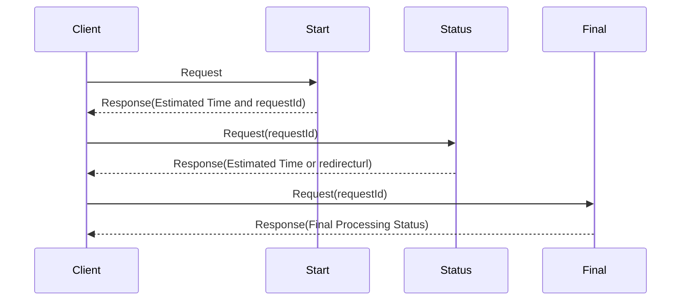

# Asynchronous Request Reply using .net
## Problem Statement
Developer's responsibility is to make api as responsibe as it can be. Imagine a situation where an api needs to handle request and the processing time of the request is too high(example - bulk file processing, update db from  excel or other file etc) . In this scenario we can't make the client wait till the processing is finished. asynchronous request reply can be one of the solution that can serve this design problem. 
> *Please note asynchronous request reply is not the only solution for this design problem other solutions are websoket and webhooks. All have their own merits and demerits*

## Diagram
sequence diagram:

## How to run the solution
This solution uses sqllite DB, which is attached to the solution.

 - download the code
 - dotnet restore
 - dotnet run

## API description
- start api (HttpPost)
	https://localhost:7201/Start/StartProcessing
	
    *samle data*
    {
		"requestBody":"test data"
	}
> this returns estimated time of completion and requestID
- status api(HttpGet)
https://localhost:7201/Status/ProcessingStatus/<requestID\>
> gets the current status if not completed else redirect to final endpoint
- final api (HttpGet)
https://localhost:7201/final/GetProcessedOutput/<requestID\>
> get the response when all processing is completed
